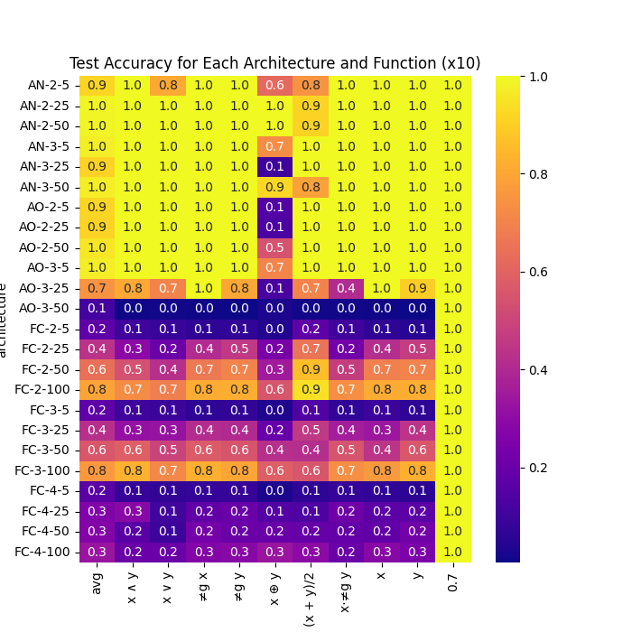

# PyTorch 'Neural Logic Rule Layer' Implementation

> Reimann, J. N., Schwung, A., Ding, S. X. (2022). _Neural logic rule layers_, Information Sciences (596), pp 185-201, https://doi.org/10.1016/j.ins.2022.03.021.

#### NLRL Paper Abstract

> Deep neural networks (DNN) are mainly black boxes, generally suffering from bad interpretability of their behavior and the results obtained. Hence, a human can not easily derive the relations modeled by the network. A reasonable way to provide interpretability for humans are logical rules. In this paper we propose neural logic rule layers (NLRL), which are able to represent arbitrary logic rules in terms of their conjunctive and disjunctive normal forms. Stacking various layers, we are theoretically able to represent arbitrary complex rules by the resulting neural network architecture. The NLRL are end-to-end trainable allowing to learn logic rules directly on the given data without needing any background information about the origin. We show in experiments, that NLRL-enhanced neural networks can model arithmetic and logical operations over the input values. Furthermore, we apply NLRL to image classification tasks and show that interpretability is provided without sacrificing classification performance by exchanging the fully-connected head of the network. We also apply NLRL to a real world industrial control problem where the task is to model the discrete control behaviour of a programmable logic controller (PLC), following a basic step sequence.

#### Respository Contents

1. [`nlrl.py`](nlrl.py): implementation of `NeuralLogicRuleLayer` module.
2. [`models.py`](models.py): `NeuralLogicNetwork` and `FullyConnectedNetwork` classes for experimentation.
3. [`dataset.py`](dataset.py): script for generating synthetic functional datasets.
   1. [`dataset.pt`](dataset.pt) is generated by running this script (incl. in repository for reproducibility).
   2. [`config.py`](config.py) contains an implementation of logical functions and store of their names.
4. [`experiment_1.py`](experiment_1.py): script for training and evaluating networks on functional datasets.
   1. [`runner.py`](runner.py): helper script for running above experiment on slurm cluster.
   2. [`run_exp.sh`](run_exp.sh): slurm batch job script.


The requirements for this repository are listed in [`requirements.txt`](requirements.txt).


#### Usage

To run the experiments locally, from scratch, you can use the following commands to define a virtual environment and install the required packages.

```bash
python3 -m venv venv
source venv/bin/activate
pip install -r requirements.txt
```

Then, you can run the experiment script with the following command, all the parameters are optional and have default values (shown below).

```sh
python "experiment_1.py" \
  --id='' \
  --arch='AO' \
  --layers=2 \
  --hidden=5 \
  --epochs=100 \
  --batch_size=20 \
  --lr=0.1 \
  --lr_div=10 \
  --lr_step=20 \
  --seed=10 \
  --function=0 \
  --dropout=0.2
```

You should see output similar to the following, which shows the training and testing loss and accuracy for the network, as well as the function and architecture used.

```
AO-2-5 (x ∧ y) [3/100]: 27.0k/1.00M [00:02<01:23], train_loss=0.425, test_loss=0.438, train_acc=78.7, test_acc=98.2
```

#### Current Issue

Currently, for the dataset included in this repository, and with ostensibly the same experimental setup as the original paper (excl. loss function which is unknown), we get better results (particularly for the `AND` function) than those reported in the paper.

Specifically, the following is a recreation of Table 1 from the paper, showing the average test accuracy for all function over 10 runs.




#### Acknowledgements and License

This repository is a reimplementation of the original paper by Reimann, Schwung, and Ding. The original paper can be found [here](https://doi.org/10.1016/j.ins.2022.03.021).

The code is authored by Alex Jackson and is licensed under the MIT License.


> This work was supported by UK Research and Innovation [grant number EP/S023356/1], in the UKRI Centre for Doctoral Training in Safe and Trusted Artificial Intelligence ([www.safeandtrustedai.org](https:/www.safeandtrustedai.org)).
